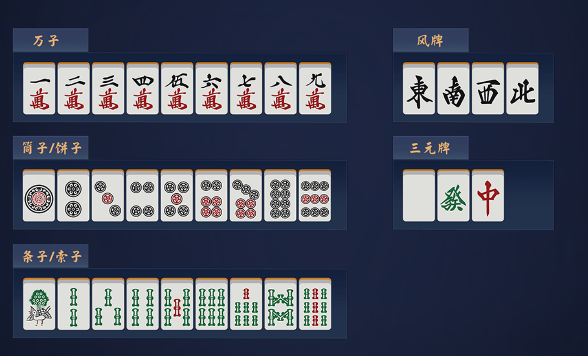
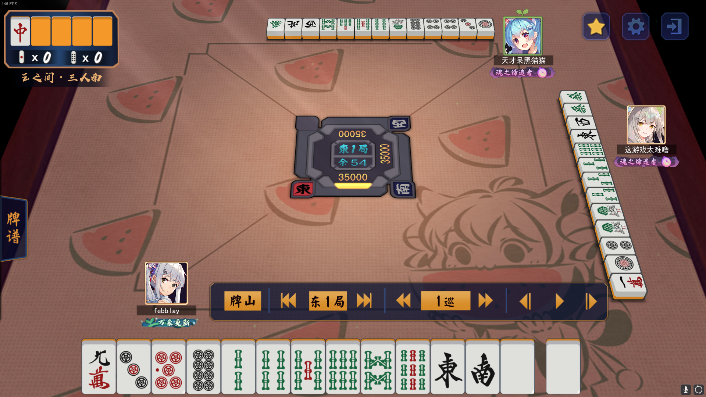
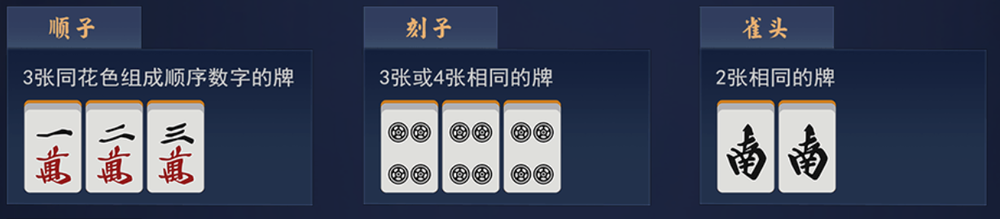
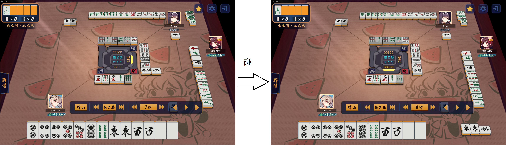
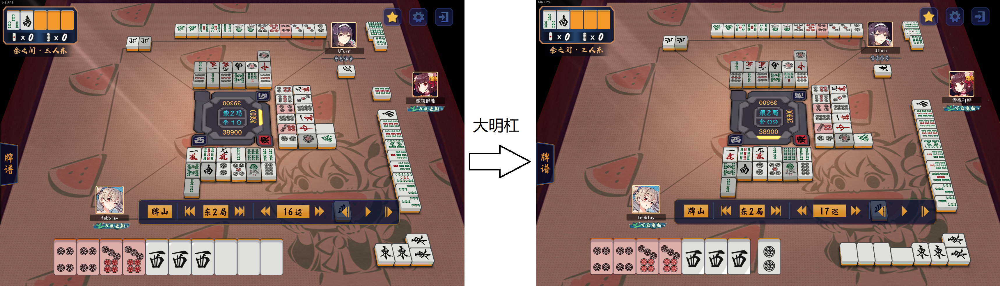
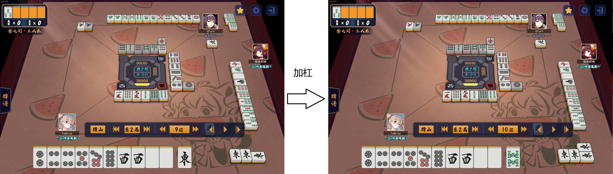
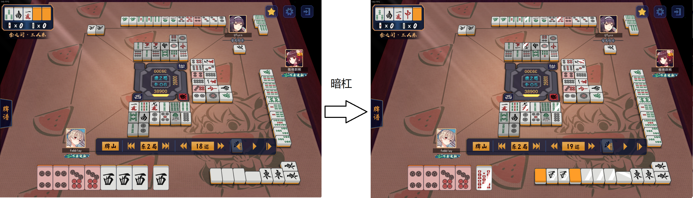
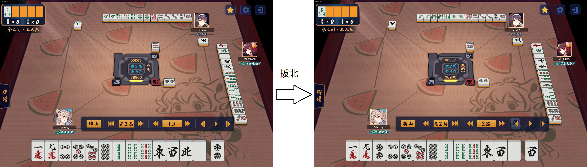

# 三麻专家系统报告

本篇报告是由*沈溯 18307130102*完成的复旦大学2021年春季学期人工智能课程的PJ. 本次PJ的要求是撰写一篇专家系统的设计报告。本次PJ选取日本三人麻将(简称三麻)为领域，探讨在三麻规则下设计一个专家系统的可行性和设计细节。本篇报告分为以下若干内容：

0. [日本三人麻将介绍](#日本三人麻将介绍)
1. [三麻专家系统设计前瞻](# 三麻专家系统设计前瞻)

## 日本三人麻将介绍

日本麻将是麻将规则的一个重要分支，起源于中国，在日本广为流传。由于立直的特性，日本麻将又称为立直麻将。日本三人麻将是基于日本麻将规则的三个人进行的麻将。相比传统的日本四人麻将，在牌种和规则上具有一定的特殊性。

### 牌种

日本麻将使用万、筒（又称为饼）、索（又称为锁或条）三种**数牌**，风牌（东南西北）和三元牌（白发中）七种**字牌**。每种牌各4张。在三人麻将中，去除了所有2~8万的字牌。

在后续的讨论中，为了简化说明，将万子、筒子和条子分别用M, P和S三个字母代替。例如，牌一万简记为1M，而三索简记为3S.

### 玩法

三麻共有3名玩家。在回合初，每名玩家各有35000分(pt), 分别位居东风位，南风位和西风位。其中，东风位的玩家被称为**庄家**，其他位的玩家被称为**闲家**。

例如，在上图中，玩家“febblay”处于东风位，玩家“这游戏太难噜”处于南风位，玩家“天才呆黑猫猫”处于西风位。从庄家开始，逆时针出牌。每人每次摸一张牌（称为摸牌），并打出一张牌（称为切牌）。三人都完成一次切牌的时间被称为**一巡**。

一局游戏由一名或多名玩家**和牌**，或者**流局**结束。

当有玩家和牌，若庄家和牌，或者流局时庄家听牌，则庄家在下一小局继续坐庄，这个过程称为**连庄**。若庄家不和牌且流局时不听牌，则庄家交给当前南风位的玩家，称为**流庄**。

流局指所有玩家均未和牌，或者达到一定条件(九种九牌或者四杠散了)情况下，进行的重新洗牌进行游戏的流程。在九种九牌或者四杠散了的情况下，庄家并不会

日本四人麻将中有场风的概念。场风根据游戏的进行，依次为东风、南风、西风、北风。当游戏开始时，场风为东风。此时称为东风场。当所有玩家都完成一次坐庄后，场风进入南风(称为南入)。同理，南风场结束会西入，西风场结束会北入。东南西北场均打完(即所有人轮流坐庄4次)的比赛(游戏)称为全庄战。由于完成一次全庄战的时间较长，全庄战在现在的休闲以及比赛中已经不常见了。半庄战指进行半个全庄的比赛，即，完成东风场和南风场的比赛。东风战指只进行东风场的比赛。三麻中延续了四麻中半庄战和东风战的概念。

事实上，每个玩家轮流坐庄的次数越多，越能最小化运气的成分。但实际上，东风战也好，半庄战也好，并不会对模切策略产生显著的影响。

### 顺子，刻子和雀头

* 顺子指3张同花色组成顺序数字的牌。注意，由于顺序的限制，顺子一定由数牌构成。

* 刻子指3张相同的牌。构成刻子的既可以是数牌，也可以是字牌。当玩家选择“杠”时，杠出的牌也被视为刻子。

* 雀头指2张相同的牌。

### 鸣牌

通俗地理解，鸣牌是将手牌亮出来给所有玩家看的行为。在常规的日麻中，鸣牌共分为三种，吃，碰和杠。在三麻中，由于不允许吃牌，所以实际的鸣牌只有碰和杠。除此之外，三麻还有特殊的拔北操作，也被视作鸣牌的一种。

#### 碰

当其他玩家打出一张牌，并且你的手中有两张与之相同的牌时，你可以选择碰牌。碰后的牌视为一组刻子，摊开放在一边。

> 如左图，主视角下家打出一张东风。由于主视角有两张东风，此时可以选择碰。碰出的东风刻子摊开放在旁边。

#### 杠

杠子是相同的4张牌。在计算和牌条件的时候，一个杠子视为一个刻子。

杠分为3种，大明杠，加杠和暗杠。无论是哪种杠，由于杠后的杠子视作刻子，杠后需要再摸一张牌。此外，每一次杠牌，都会翻开一张新的王牌，作为宝牌的指示牌。在一局中，如果有超过一个玩家开合杠总计4次，则会导致四杠散了的流局。

##### 大明杠

大明杠(又称明杠)是当其他玩家打出一张牌时，你手上有3张相同的牌（即，有这张牌的暗刻，暗刻指不是碰出的刻子），则此时可以选择杠牌，得到的杠子摊开放在一边。

> 如左图，主视角下家摸9s切白牌。而主视角恰有一组白的暗刻。此时可以选择大明杠。

##### 加杠

加杠是指当摸到一张牌，并且先前你通过碰牌获得了这张牌的刻子，此时你可以选择加杠，将刻子变成杠子。

> 如左图，主视角当前进张为东风。由于主视角已经有一组碰过的东风刻子，此时可以选择加杠。

##### 暗杠

暗杠是指手牌中有4张相同的未鸣牌的牌，此时可以选择暗杠，杠出的杠子摊开放在一边。

> 如左图，主视角当前进张为西风。加上进张的西风，主角恰有4张未鸣的西风。此时可以选择暗杠。

#### 拔北(仅限三麻)

在三麻中，由于没有北家，字牌北有特殊的作用。

当玩家手上有北风时，玩家在自己的回合可以选择进行拔北操作，将北鸣放在桌面，并从岭上牌中摸一张牌。鸣出的北风称为拔北宝牌，在清算点数的时候，每一张拔北宝牌效力等同于一张宝牌。拔北操作是鸣牌的一种。

> 如左图，主视角的手牌中有一张北风。轮到主视角回合时，主视角可以在摸牌后切牌前进行拔北操作，将北风鸣放在桌上，并摸一张牌。

> 杠和拔北操作后的并不是从牌山中摸牌，而是从岭上牌中摸牌。如果摸到的牌恰好是听的牌，并且玩家选择和牌，此时记岭上开花役。

### 和牌

和牌遵循一定的原则。基本的原则是总计四个顺子或刻子再加一个雀头。也有一些特殊的役种，例如七对子以及国士无双，不需要服从上述和牌原则。

此外，在日麻中，无役不能和牌。日麻中役种繁多，以下只介绍几类常见的役种。更多的役种可以参考此

## 三麻专家系统设计前瞻

一个优秀的专家系统应该能够和一名优秀的日麻玩家一样，能够通过观察别家牌河，推测企图胡的牌型，并预估其和牌的大小，与自己的瞄准的牌型相对比，以判断需要进攻或防守。在进攻时，能够选择最有效率或是收益最大的切牌方式；在防守时需要选择合适的策略，是弃和全防，还是在防守过程中悄悄寻找和牌的契机。

综上，一个三麻专家系统应当由如下3个子系统构成

* [攻守判定子系统](#攻守判定子系统): 判断当前应当进攻还是防守
* [进攻子系统](#进攻子系统): 用于敲定进攻时的切牌策略
* [防守子系统](#防守子系统): 用于敲定防守时的切牌策略

![图片: 描述子系统切换的fsm]

## 进攻子系统

设计进攻子系统的过程实际上是一个牌效分析的过程。牌效分析的目的是做最有效率的**切牌**，以及最有效率的**鸣牌**。所谓最有效率的切牌，是使得切出一张手牌后，能够让剩下的手牌保留最广的**进张**面，也就是一个比较切出每张手牌，进入听牌阶段需要经历的**巡数**的期望值，然后切掉会让听牌时间最长的一张牌的过程。所谓最有效率的鸣牌，也是类似，即在获得一次鸣牌机会的时候，评估鸣牌是否会加快听牌速度来判断是否应该鸣牌。

在介绍进攻切牌策略之前，需要介绍以下几类术语

1. 散牌

   散牌指无法与其他牌构成搭子的单牌。简而言之，在手牌中所有落单的字牌，以及不存在相邻以及相间数牌的序数牌，都是散牌。

   散排的特性是进张较难。如果是字牌，只有再进一张相同的字牌才能算是有效进张。而如果是序数牌，则需要进一张相同、相邻或者相间的数牌。

2. 搭子

   搭子指差一张牌即可形成刻子或者顺子的牌型。

   搭子有两类，一类是顺子型的搭子，另一类是崁张类型的搭子。顺子类型的搭子就是两张连续的牌，这类牌

三麻的一个突出特点是由于没有大部分万子牌，仅靠模切进张的速度很快.